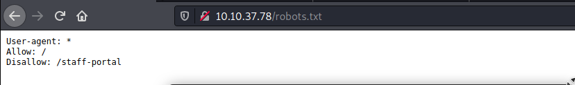
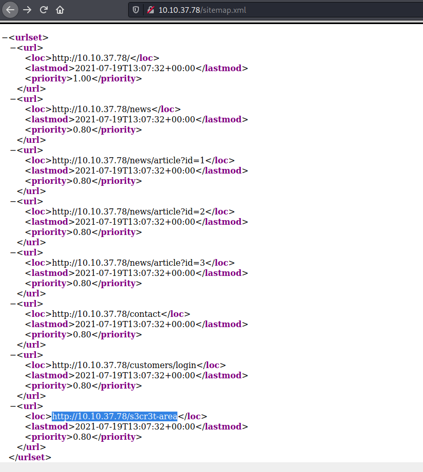
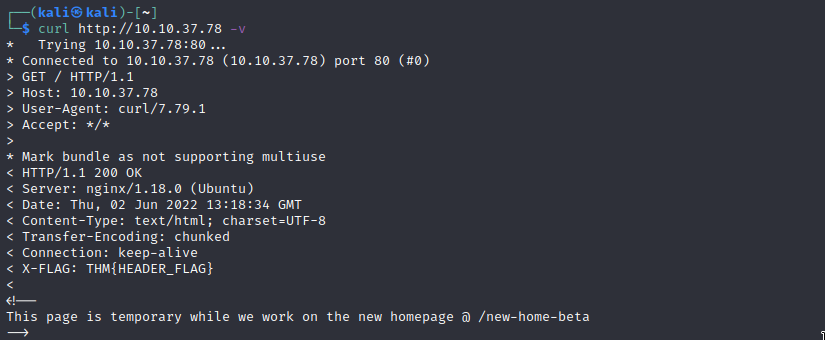

# Content Discovery 

## Robots.txt
The robots.txt file is a document that tells search engines which pages they are and aren't allowed to show on their search engine results or ban specific search engines from crawling the website altogether. It can be common practice to restrict certain website areas so they aren't displayed in search engine results. These pages may be areas such as administration portals or files meant for the website's customers. This file gives us a great list of locations on the website that the owners don't want us to discover as penetration testers.\

So if a webserver is running on a machine, we should try to go to http://<IP>/robots.txt

\

## Sitemap.xml

Unlike the robots.txt file, which restricts what search engine crawlers can look at, the sitemap.xml file gives a list of every file the website owner wishes to be listed on a search engine. These can sometimes contain areas of the website that are a bit more difficult to navigate to or even list some old webpages that the current site no longer uses but are still working behind the scenes.\

So if a webserver is running on a machine, we should try to go to http://<IP>/sitemap.xml

## Http Headers

Running 'curl http://<IP> -v' will print out the headers and the html of a webpage. This is good because 
these headers can sometimes contain useful information such as the webserver software and possibly the programming/scripting language in use. Using this information, we could find vulnerable versions of software being used.

## Wappalyzer

Wappalyzer (https://www.wappalyzer.com/) is an online tool and browser extension that helps identify what technologies a website uses, such as frameworks, Content Management Systems (CMS), payment processors and much more, and it can even find version numbers as well.

## S3 Buckets
S3 Buckets are a storage service provided by Amazon AWS, allowing people to save files and even static website content in the cloud accessible over HTTP and HTTPS. The owner of the files can set access permissions to either make files public, private and even writable. Sometimes these access permissions are incorrectly set and inadvertently allow access to files that shouldn't be available to the public. The format of the S3 buckets is http(s)://{name}.s3.amazonaws.com where {name} is decided by the owner, such as tryhackme-assets.s3.amazonaws.com. S3 buckets can be discovered in many ways, such as finding the URLs in the website's page source, GitHub repositories, or even automating the process. One common automation method is by using the company name followed by common terms such as {name}-assets, {name}-www, {name}-public, {name}-private, etc.
